# Laporan UAT Frontend

## Code Cracker: The Investigation Ladder

**Tanggal pengujian:** 26 Juli 2026  
**Metode:** Playwright MCP, headed Chromium  
**Environment:** server Node.js lokal, database sementara, localhost  
**Status akhir:** **PASS untuk alur browser yang diuji, dengan catatan evidence**

> Bukti screenshot 01--13 berasal dari sesi browser 26 Juli 2026. Screenshot
> 14--15 adalah follow-up workflow soal bergambar. Perilaku Tahap III terkini
> yang menjadi acuan adalah draft level, finalisasi server saat timer habis,
> mode terisolasi, recovery sesi, panel admin, dan leaderboard publik. Jalankan
> ulang smoke test headed dengan build terakhir sebelum hari-H.

## 1. Tujuan

UAT ini memvalidasi aplikasi dari sudut pandang pengguna browser:

- peserta masuk dengan kode tim;
- admin mengotorisasi dan mengendalikan fase pertandingan;
- perubahan fase diterima peserta secara real-time;
- timer, pilihan ganda, draft jawaban per level, clue, resolution, feedback bonus, dan leaderboard;
- tampilan mode simulasi dan mode resmi;
- participant view, admin view, dan leaderboard screen;
- tampilan headed browser dan viewport mobile.

UAT ini melengkapi automated UAT backend yang tercatat di
[`UAT_Code_Cracker.md`](UAT_Code_Cracker.md).

## 2. Konfigurasi Pengujian

| Komponen | Nilai |
|---|---|
| Browser | Chromium headed melalui Playwright MCP |
| URL pengujian | `http://127.0.0.1:<port>` |
| Tim peserta | Kode UAT dari `CODE_CRACKER_TEAM_LOGIN_CODES` / Tim Alpha |
| Password admin | Nilai `CODE_CRACKER_ADMIN_PASSWORD` pada lingkungan UAT |
| Database | File sementara; tidak memakai database produksi |
| Mode utama | SIMULATION |
| Durasi fase cepat | 1--10 detik untuk transisi otomatis |
| Durasi resolution validasi | 600 detik agar cukup untuk interaksi headed |
| Viewport mobile sebelumnya | 390 x 844 |

## 3. Ringkasan Hasil

| Area | Hasil | Bukti |
|---|---|---|
| Login peserta | PASS | Screenshot 01 |
| Login dan otorisasi admin | PASS | Screenshot 02 |
| Kontrol mode dan fase | PASS | Screenshot 02, 03, 13 |
| Transisi real-time ke Level 1 | PASS | Screenshot 03, 04 |
| Soal, timer, dan navigasi 5 soal | PASS | Screenshot 04 |
| Draft level, navigasi, dan perubahan pilihan | PASS* | Screenshot 04; backend UAT |
| Timer habis dan clue board | PASS | Screenshot 06, 07, 08 |
| Transisi Level 1 ke Level 2 ke Level 3 | PASS | Screenshot 06, 07, 08 |
| Final resolution | PASS | Screenshot 09, 10, 11 |
| Leaderboard admin setelah bonus resolution | PASS | Screenshot 12 |
| Isolasi mode resmi dari simulasi | PASS | Screenshot 13 |
| Leaderboard screen read-only tanpa login | PASS* | URL `/?screen=leaderboard`; smoke check perlu diulang |
| Timer dan kontrol admin Tahap III | PASS | Screenshot 02, 03 |
| Viewport mobile | PASS | Validasi sebelumnya pada 390 x 844 |

## 4. Detail Skenario UAT

| ID | Skenario | Hasil yang diharapkan | Hasil aktual | Status |
|---|---|---|---|---|
| FE-AUTH-01 | Peserta mengisi `TIM01` dan bergabung | Peserta masuk ke layar menunggu | Tim Alpha tampil dan menunggu fase dimulai | PASS |
| FE-ADMIN-01 | Admin mengisi password dan otorisasi | Kontrol fase dan tabel 15 tim tampil | Kontrol lobby dan tabel leaderboard tampil | PASS |
| FE-ADMIN-02 | Admin memulai Level 1 | Fase berubah ke `LEVEL_1` | Admin menampilkan `Mode: SIMULATION \| Fase: LEVEL_1` | PASS |
| FE-GAME-01 | Peserta menerima perubahan fase | Layar menunggu berubah menjadi halaman soal | Peserta menerima Level 1 secara real-time | PASS |
| FE-GAME-02 | Peserta membuka halaman Level 1 | Timer, 5 navigasi soal, pertanyaan, opsi radio, dan status draft tampil | Semua komponen tampil | PASS |
| FE-GAME-03 | Peserta mengganti pilihan | Pilihan dapat diubah sebelum deadline; skor belum berubah sebelum finalisasi | Perilaku ini lulus pada automated UAT; screenshot 05 adalah bukti sesi lama | PASS* |
| FE-TIMER-01 | Timer Level 1 habis | Fase berubah ke clue board | Clue Level 1 tampil otomatis | PASS |
| FE-CLUE-01 | Admin memulai Level 2 setelah clue | Peserta melihat clue Level 1 dan Level 2 | Dua clue tampil di clue board | PASS |
| FE-CLUE-02 | Admin memulai Level 3 setelah clue | Peserta melihat clue Level 3 | Tiga clue tampil di clue board | PASS |
| FE-RES-01 | Admin memulai final resolution | Kandidat Alpha--Delta tampil | Halaman deduksi dan empat kandidat tampil | PASS |
| FE-RES-02 | Peserta memilih Kandidat Charlie | Kandidat valid diterima dan bonus diberikan | `Benar! +30 poin bonus` | PASS |
| FE-SCORE-01 | Admin melihat leaderboard | Skor peserta diperbarui | Tim Alpha tampil dengan 30 poin | PASS |
| FE-MODE-01 | Admin berpindah ke mode resmi | Mode resmi dimulai dari lobby dan skor nol | `Mode: OFFICIAL \| Fase: LOBBY`; semua skor 0 | PASS |
| FE-VIEW-01 | Membuka leaderboard screen | Layar peringkat tidak meminta login tim/admin dan tidak menyediakan kontrol | Route `/?screen=leaderboard` tersedia; smoke check visual perlu diulang | PASS* |
| FE-RESP-01 | Browser diperkecil ke 390 x 844 | Layout tetap dapat digunakan | Halaman Level 1 dan kontrol jawaban tetap tampil | PASS |

## 5. Bukti Screenshot

### 5.1 Peserta menunggu pertandingan

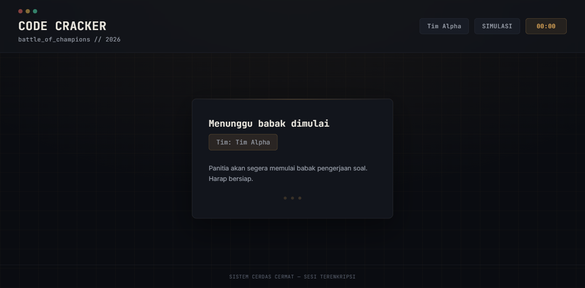

### 5.2 Admin lobby dan tabel 15 tim

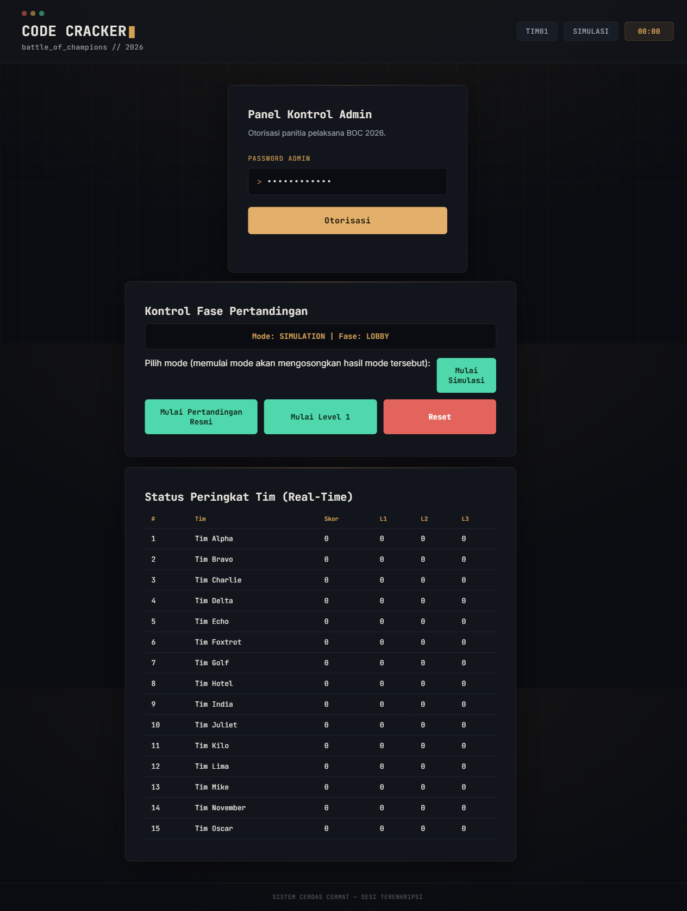

### 5.3 Admin memulai Level 1

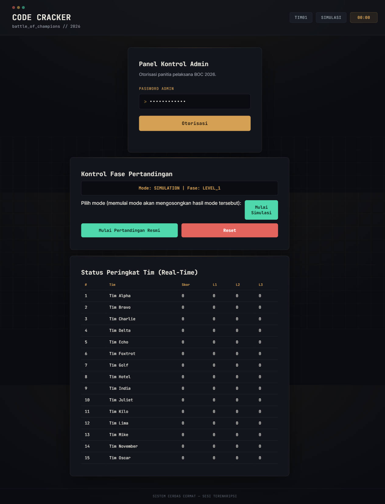

### 5.4 Peserta menerima Level 1

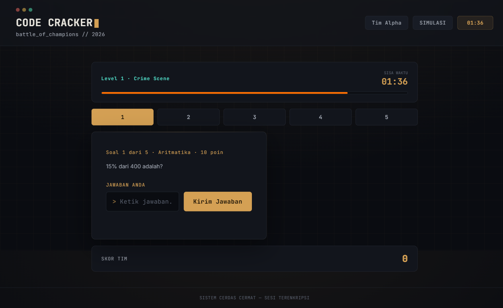

### 5.5 Bukti sesi awal feedback jawaban (arsip)

Screenshot ini berasal dari sesi sebelum perilaku draft level dibekukan. Pada
build Tahap III, peserta tidak menerima feedback benar/salah per soal sebelum
timer habis; gunakan breakdown hasil level setelah finalisasi sebagai acuan.

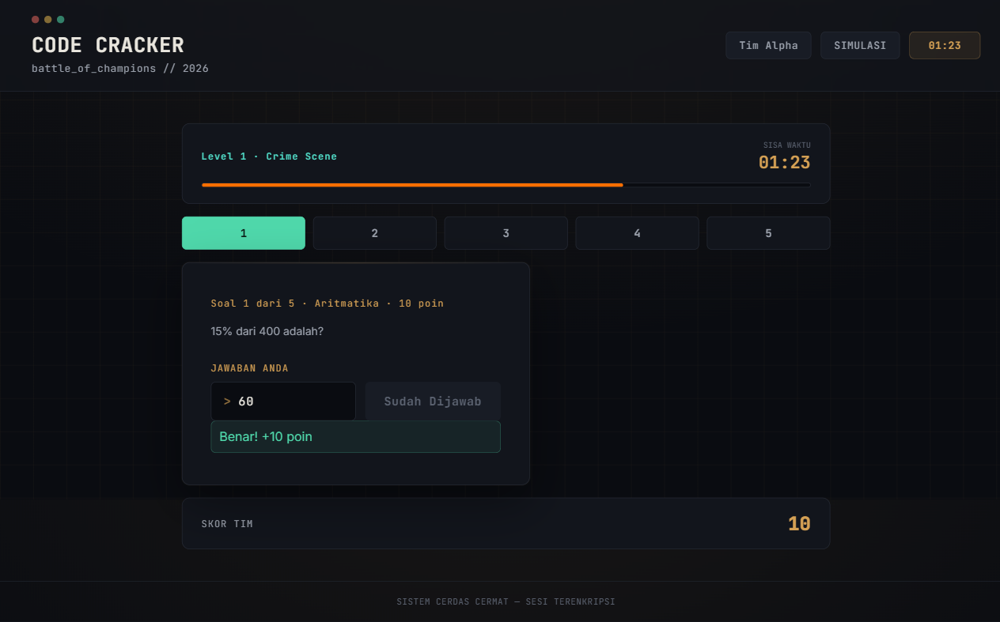

### 5.6 Timer habis dan clue Level 1

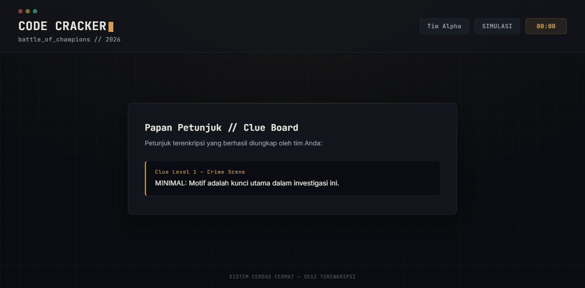

### 5.7 Clue Level 2 terbuka

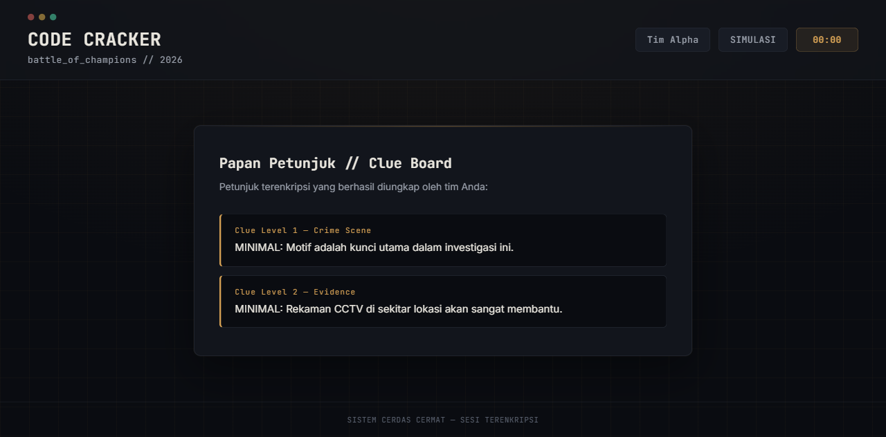

### 5.8 Clue Level 3 terbuka

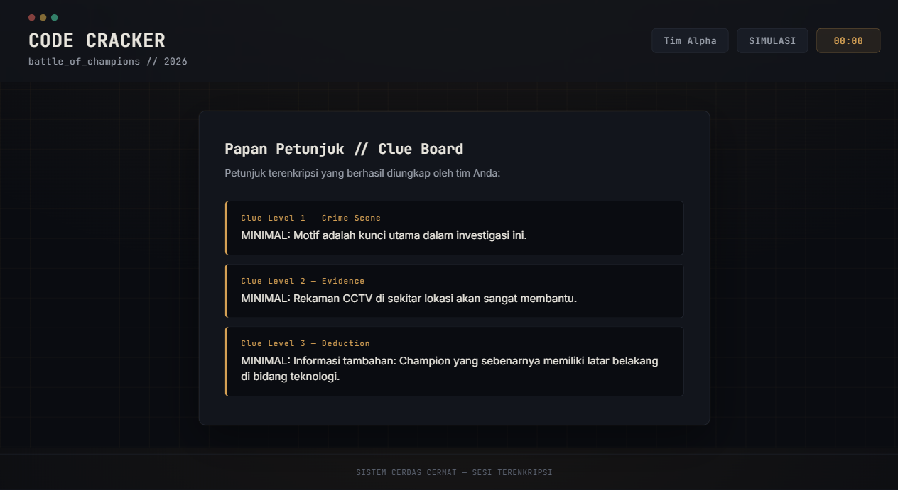

### 5.9 Halaman final resolution

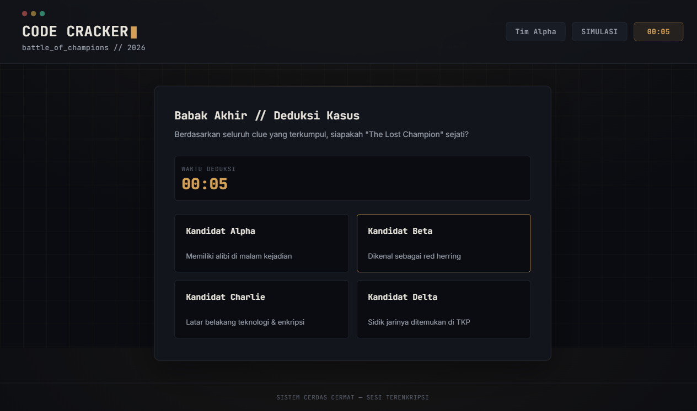

### 5.10 Kandidat dipilih

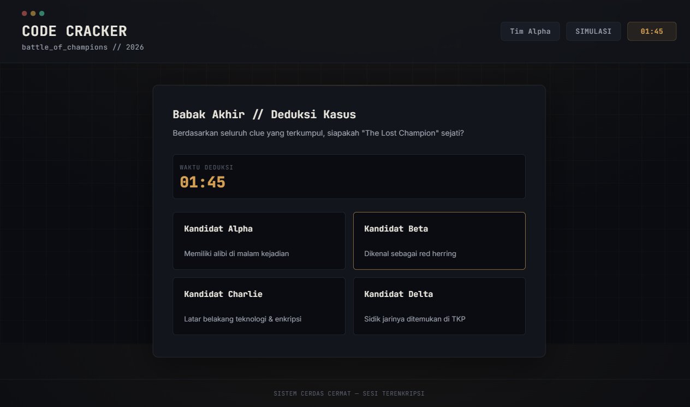

### 5.11 Feedback resolution benar

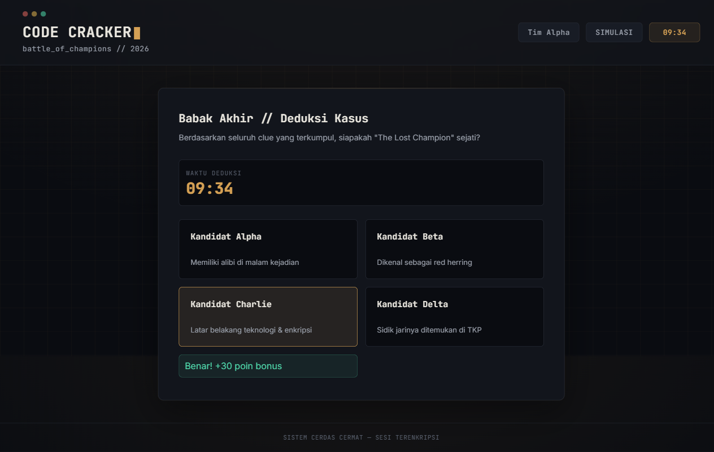

### 5.12 Leaderboard admin setelah resolution

### 5.13 Mode resmi terisolasi

### 5.14 Katalog ID dan soal bergambar

Follow-up setelah implementasi soal bergambar juga lulus:

- panel admin menampilkan `question_id` untuk mode aktif;
- status gambar menunjukkan `q_1.png (1280x632)`;
- gambar berhasil tampil pada halaman peserta dari URL
  `/uploads/questions/simulation/q_1.png`;
- fallback soal teks tetap tersedia jika gambar tidak ada;
- file lebih besar dari 5 MB atau berdimensi di atas 4096px ditandai tidak valid;
- fixture PNG sementara dan database UAT sudah dihapus setelah pengujian.

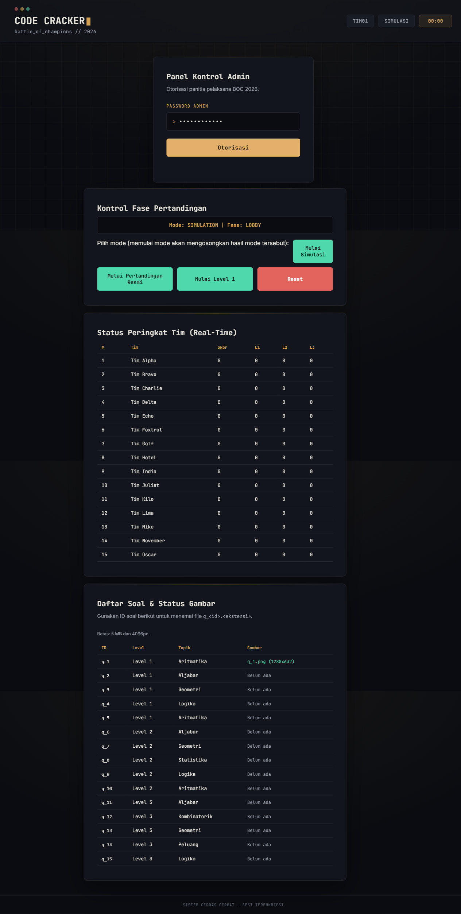

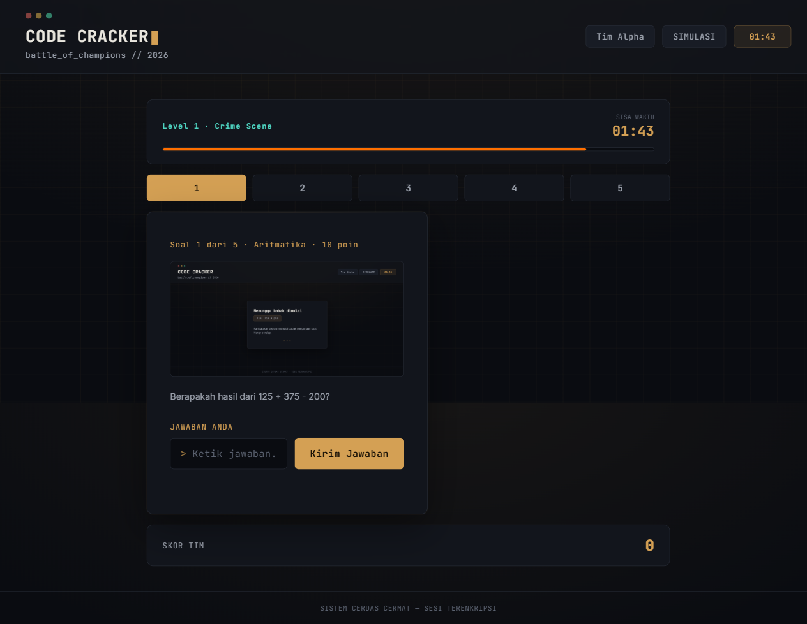

## 6. Temuan dan Penanganan

### 6.1 Favicon 404

Pada sesi awal ditemukan request `favicon.ico` berstatus 404. Ini merupakan
temuan kosmetik dan sudah diperbaiki dengan menambahkan
`server/public/favicon.svg` serta referensinya di `index.html`.

### 6.2 Durasi simulasi terlalu singkat untuk headed UAT

Durasi 5--10 detik cukup untuk automated test, tetapi tidak cukup untuk
interaksi manual melalui browser headed dan screenshot MCP. Pengujian resolution
diulang dengan durasi 600 detik dan berhasil. Ini adalah konfigurasi harness
UAT, bukan perubahan durasi pertandingan resmi.

### 6.3 Koneksi ke port sesi yang sudah ditutup

Console browser menyimpan error `ERR_CONNECTION_REFUSED` dari tab sesi UAT
lama yang sudah dihentikan. Error tersebut tidak berasal dari server sesi
yang sedang diuji dan tidak memengaruhi hasil sesi final.

### 6.4 Daftar ID soal dan validasi gambar

Temuan usability bahwa panitia harus mengetahui `question_id` sudah ditangani
dengan katalog soal di panel admin. Validasi ukuran dan dimensi juga sudah
ditambahkan. Tidak ada temuan terbuka untuk workflow soal bergambar.

## 7. Kriteria Go / No-Go

### Kriteria GO

- Alur peserta dan admin lulus.
- Transisi real-time dan timer lulus.
- Jawaban dan feedback skor lulus.
- Draft level dapat diubah sebelum deadline dan difinalisasi server saat timer habis.
- Leaderboard screen dapat dibuka tanpa login dan tetap read-only.
- Clue board dan final resolution lulus.
- Leaderboard memperlihatkan hasil resolution.
- Mode resmi dimulai dari lobby dengan skor nol.
- Tidak ada blocker fungsional pada sesi final.

### Keputusan

**GO untuk tahap simulasi/dry run, dengan catatan UAT visual leaderboard perlu
diulang memakai build terakhir.**

Sebelum pertandingan resmi, tetap lakukan dry run fisik dengan minimal 15
perangkat, jaringan yang akan digunakan, QR code, proyektor leaderboard,
reconnect, backup database, dan restart server.

## 8. Rekomendasi Sebelum Hari-H

1. Ganti dataset resmi sementara dengan soal dan clue final.
2. Jalankan automated UAT backend (`npm.cmd run test:uat`).
3. Jalankan satu dry run fisik dengan 15 perangkat.
4. Uji reconnect satu atau lebih perangkat pada setiap fase.
5. Backup database sebelum memulai pertandingan resmi.
6. Gunakan durasi resmi dari konfigurasi produksi; durasi 600 detik hanya
   digunakan untuk validasi browser headed.
7. Ambil screenshot baru untuk participant view, admin view, dan
   `/?screen=leaderboard` setelah smoke test build terakhir.

`*` menandai hasil yang membutuhkan evidence browser terbaru atau didukung oleh
automated UAT, bukan screenshot sesi awal.
